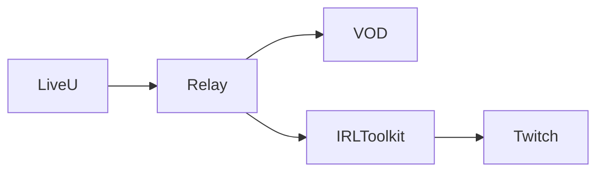

# LiveU Clean-Feed VOD Recorder

Relay server that sits between LiveU encoder and IRLToolkit to capture high-quality, clean-feed recordings before overlays are applied.

## Architecture



**Flow:**

1. LiveU streams to relay server (SRT or RTMP)
2. Relay records hourly segments (original quality, no re-encode)
3. Relay forwards stream to IRLToolkit
4. When stream ends: uploads segments to S3 and emails download links
5. IRLToolkit adds overlays and streams to Twitch

## Requirements

- VPS with Docker and Docker Compose
- AWS S3 bucket (for recordings)
- SendGrid account (for email notifications)
- IRLToolkit host/credentials

### VPS Specifications

**For 1080p60 @ 12 Mbps:**

- 2 vCPU, 2 GB RAM
- 200 GB SSD
- 1 Gbps network, 3–5 TB monthly transfer

**For 4K60 @ 50 Mbps:**

- 4 vCPU, 4–8 GB RAM
- 1–2 TB SSD
- 1 Gbps network (unmetered preferred), 10–20 TB monthly transfer

## Setup

### 1. Clone and configure

```bash
# Copy environment template
cp .env.example .env

# Edit with your actual credentials
nano .env
```

### 2. DigitalOcean Spaces Setup

Create a Spaces bucket and API key:

1. **Create Spaces bucket:**

   - Go to: https://cloud.digitalocean.com/spaces
   - Create new Space (choose region close to your VPS)
   - Note your Space name and region (e.g., `nyc3`)

2. **Create API key:**

   - Go to: https://cloud.digitalocean.com/account/api/spaces
   - Generate new key (save the Access Key and Secret)
   - Note your endpoint URL (e.g., `https://nyc3.digitaloceanspaces.com`)

3. **Configure .env:**
   ```bash
   SPACES_ACCESS_KEY=your_spaces_access_key
   SPACES_SECRET_KEY=your_spaces_secret_key
   SPACES_REGION=nyc3
   SPACES_BUCKET=your-space-name
   SPACES_ENDPOINT=https://nyc3.digitaloceanspaces.com
   ```

### 3. SendGrid Setup

1. Sign up at https://sendgrid.com (free tier: 100 emails/day)
2. Verify a sender email address
3. Create an API key: https://app.sendgrid.com/settings/api_keys
4. Paste into `.env`

### 4. Configure IRLToolkit forwarding

Edit `mediamtx.yml` line 29:

```yaml
runOnReady: >
  ffmpeg -nostdin -loglevel warning -rtsp_transport tcp
  -i $RTSP_URL
  -map 0 -c copy -f flv rtmp://YOUR_IRLTOOLKIT_IP:1935/live/YOUR_STREAM_KEY
```

Replace:

- `YOUR_IRLTOOLKIT_IP` with IRLToolkit machine IP
- `YOUR_STREAM_KEY` with the ingest key from IRLToolkit

### 5. Start the relay

```bash
docker compose up -d
```

Check logs:

```bash
docker compose logs -f mediamtx
```

### 6. Configure LiveU

Point LiveU encoder to relay server:

**SRT (recommended for cellular):**

- Mode: Caller
- URL: `srt://YOUR_VPS_IP:7001?streamid=liveu&latency=120`

**RTMP (if SRT not available):**

- URL: `rtmp://YOUR_VPS_IP:1935/liveu`

### 7. Configure IRLToolkit

Add a custom RTMP input:

- URL: `rtmp://YOUR_VPS_IP:1935/liveu`

Or if you configured push in mediamtx.yml, IRLToolkit will receive the stream automatically.

## Usage

1. Start streaming on LiveU
2. Relay automatically records hourly segments to `/vod/liveu/`
3. Relay forwards stream to IRLToolkit
4. IRLToolkit adds overlays and streams to Twitch
5. When LiveU stops: relay uploads segments to S3 and emails download links to client

## Local Testing (without LiveU)

Simulate LiveU with ffmpeg:

```bash
# Generate a test file or use existing high-bitrate video
ffmpeg -re -stream_loop -1 -i input_1080p60.mp4 \
  -c copy -f mpegts "srt://127.0.0.1:7001?mode=caller&latency=120"
```

Stop with Ctrl+C to trigger the end-of-stream upload and email.

## Cost Estimate

**9-hour stream at 1080p60, 12 Mbps:**

- File size: ~48.6 GB (5.4 GB/hour)
- DigitalOcean Spaces storage: ~$1/month (until deleted)
- Spaces egress (one download): ~$4.50
- VPS egress: included in transfer allowance (budget ~100 GB/day for relay+upload)

**SendGrid:**

- Free tier: 100 emails/day
- One email per stream = effectively free

## Monitoring

Check relay health:

```bash
curl http://YOUR_VPS_IP:8889/v3/paths/list
```

View recordings:

```bash
ls -lh vod/liveu/
```

## Troubleshooting

**Stream not recording:**

- Check LiveU is pushing to correct IP:port
- Check firewall: `sudo ufw allow 7001/udp` and `sudo ufw allow 1935/tcp`
- Check logs: `docker compose logs -f mediamtx`

**Email not sent:**

- Verify SendGrid API key is valid
- Check sender email is verified in SendGrid
- Review logs for HTTP error codes

**IRLToolkit not receiving stream:**

- Verify `runOnReady` command in `mediamtx.yml` has correct host/key
- Check IRLToolkit is listening on RTMP port 1935
- Test with: `ffprobe rtmp://IRL_TOOLKIT_HOST:1935/live/STREAM_KEY`

**Spaces upload fails:**

- Verify DigitalOcean Spaces credentials in `.env`
- Check Spaces API key permissions
- Test: `aws s3 ls s3://your-bucket --endpoint-url https://nyc3.digitaloceanspaces.com`

## Files and Directories

```
projectLiveUVOD/
├── docker-compose.yml       # Container orchestration
├── mediamtx.yml            # Relay and recording config
├── .env                    # Secrets (not in git)
├── .env.example            # Template
├── scripts/
│   └── on_end.sh          # Upload and email handler
├── vod/                   # Local recordings (before S3 upload)
│   └── liveu/            # Hourly segments
└── README.md
```

## Security Notes

- Keep `.env` private (already in `.gitignore`)
- Use strong IAM policies (least privilege)
- S3 bucket should be private; access via presigned URLs only
- Consider SRT passphrase: add `&passphrase=yourpass` to SRT URL
- Enable VPS firewall; allow only necessary ports

## Next Steps

- Add automated cleanup of local `/vod` after successful S3 upload
- Implement CloudFront for faster downloads
- Add webhook notifications (Slack, Discord)
- Build a minimal web portal for browsing S3 recordings
# liveU-relay-record
